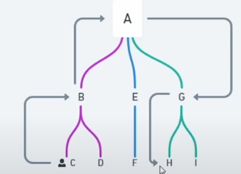
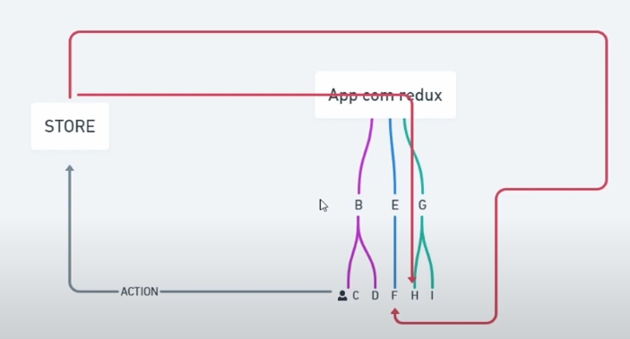
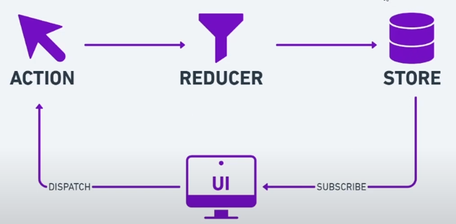
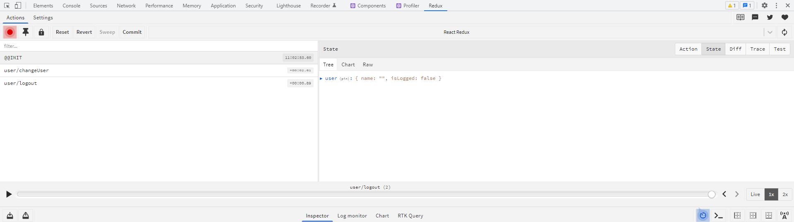

# Projeto ReactTS e Simple JS utilizando Redux 

## Consumo de states na aplicação sem uso de gerenciador

## Aplicação com redux

* São passadas informações dos componentes através do store 

## Modelo estrutural utilizando redux

# Utilizando a estrutura redux no React

